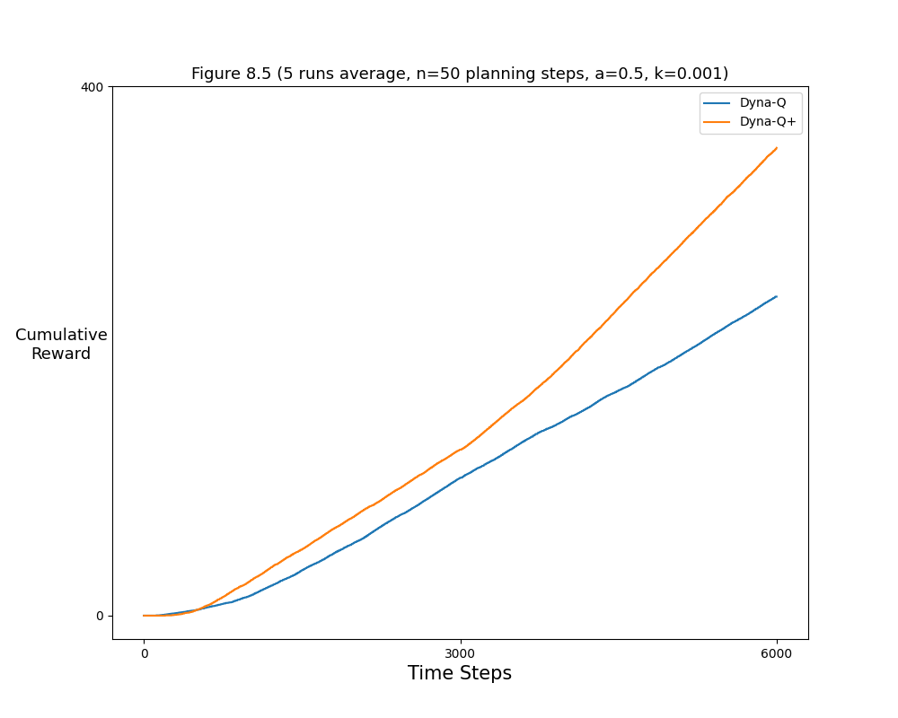
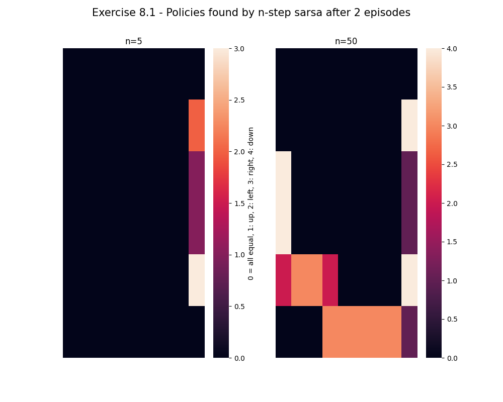

## Figures

### Figure 8.2:


```bash
python figures 8.2
```

### Figure 8.3:


```bash
python figures 8.3
```

### Figure 8.4:


```bash
python figures 8.4
```

### Figure 8.5:




```bash
python figures 8.5
```

### Figure 8.7:


```bash
python figures 8.7
```

### Figure 8.8:


```bash
python figures 8.8
```

## Exercises

### Exercise 8.1



```bash
python figures ex8.1
```

### Exercise 8.4


```bash
python figures ex8.4
```

## Sections

### Section 8.1

testing the random-sample one-step tabular q-planning algorithm with the dynamaze environement, assuming we have access to a perfect model of the environment. step size decays to 0 by multiplying by `(1 - 1 / n_updates)` every step.


```bash
python figures section8.1
```
